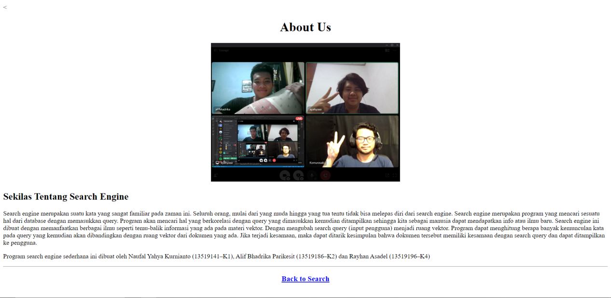

# ASRAY Tech Simple Search Engine
> Merupakan suatu implementasi sederhana dari konsep search engine,yang didalamnya menggunakan metode Bag of Words, Vektor, 
dan cosine similarity untuk menemukan dokumen dengan relevansi tertinggi.Project ini merupakan bagian dari Tugas Besar 
mata kuliah Aljabar Linier dan Geometri IF2123, Semester 1 2020/2021.

## Table of contents
* [Screenshots](#screenshots)
* [Technologies](#technologies)
* [Setup](#setup)
* [Features](#features)
* [Status](#status)
* [Inspiration](#inspiration)
* [Contact](#contact)

## Screenshots

## Technologies
* Bag of Word
* Cosine Similarity
* Web Scraping
* Stemming

## Setup
Describe how to install / setup your local environement / how to run app.py
* install pip (if not already installed)
	* https://phoenixnap.com/kb/install-pip-windows
* if Pip already installed:
* Install VirtualEnvironment
	* pip install virtualenv
* Install Flask
	* pip install flask
* Install nltk.corpus, nltk.tokenize, nltk.stem modules
	* pip install nltk
	* Then, enter the python shell in your terminal by simply typing python
		* import nltk
		* nltk.download(‘all’)

## Features
List of features ready 
* Upload Multiple or Single File txt
* Search Document with Query
* View Document File after Query Result
* About Page

## Status
Project is:  _finished_

## Inspiration
Projek ini terinspirasi dari spesifikasi Tugas Besar 2 Ajabar linier dan Geometri IF2123.

