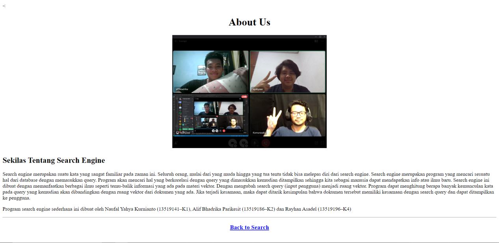

# ASRAY Tech Simple Search Engine
> merupakan suatu implementasi sederhana dari konsep search engine,yang didalamnya menggunakan metode Bag of Words, Vektor, 
dan cosine similarity untuk menemukan dokumen dengan relevansi tertinggi.Project ini merupakan bagian dari Tugas Besar 
mata kuliah Aljabar Linier dan Geometri IF2123, Semester 1 2020/2021.

## Table of contents
* [General info](#general-info)
* [Screenshots](#screenshots)
* [Technologies](#technologies)
* [Setup](#setup)
* [Features](#features)
* [Status](#status)
* [Inspiration](#inspiration)
* [Contact](#contact)

## General info

## Screenshots

## Technologies
* Bag of Word
* Cosine Similarity
* Web Scraping
* Stemming dan Lemmatizing

## Setup
Describe how to install / setup your local environement / add link to demo version.

## Code Examples
Show examples of usage:
`put-your-code-here`

## Features
List of features ready and TODOs for future development
* Awesome feature 1
* Awesome feature 2
* Awesome feature 3

To-do list:
* Wow improvement to be done 1
* Wow improvement to be done 2

## Status
Project is:  _finished_

## Inspiration
Add here credits. Project inspired by..., based on...

## Contact
